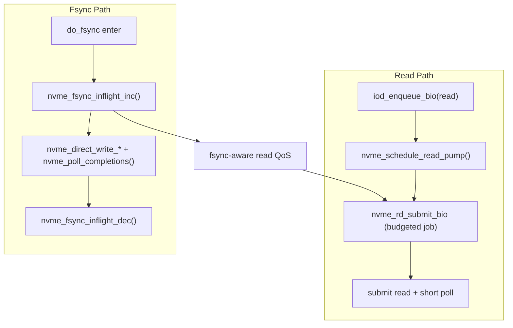

# Unified IO Pump: Design and Implementation Notes

## Background

The secure daemon previously partitioned I/O workers into dedicated read workers and non-read workers. In practice, this caused poor work conservation:

- Read workers were reserved even when the workload was write-heavy.
- Write/fsync paths could not effectively use all available worker capacity under skewed workloads.
- `rpc_libfs_handler_thpool` and I/O workers share the same pool, so static partitioning amplified contention side effects.

## Design Goals

- Remove static read-worker reservation.
- Keep fsync latency-oriented direct NVMe fast path intact.
- Allow read path to adaptively consume workers based on backlog.
- Introduce fsync-aware QoS to protect fsync tail latency.
- Avoid complete read starvation during fsync-heavy periods.

## Non-Goals

- Do not split a single fsync transaction across multiple workers.
- Do not redesign fsync ordering semantics (`data -> desc -> commit`).
- Do not replace direct fsync submit/poll with threadpool job dispatch.

## High-Level Architecture

## Core Policy

### 1) Budgeted Read Pump

Read processing now runs as short-lived jobs instead of long-lived dedicated loops:

- A read enqueue schedules one or more pump jobs.
- Each pump consumes a bounded submit budget, then returns.
- If backlog remains, scheduler re-enqueues pump jobs subject to QoS caps.

This preserves responsiveness and prevents fixed thread reservation.

### 2) Fsync-Aware QoS

When fsync is in flight:

- Reduce max concurrent read pumps.
- Reduce per-pump read submit budget.
- Keep a minimum read service quota to avoid full starvation.

### 3) Fsync Fast Path Preservation

Fsync still uses direct NVMe submit/poll path and keeps existing ordering guarantees.  
Only an inflight signal is added to inform read QoS decisions.

## Implemented Changes

### `oxbow/secure_daemon/src/io_dispatcher.c`

- Removed dedicated read-worker pre-launch model.
- Read submit path now:
  - enqueue to read ring
  - call `nvme_schedule_read_pump()`
- Write submit path remains `thpool_add_work(..., nvme_wr_submit_bio, ...)`.

### `oxbow/secure_daemon/include/io/nvme.h`

Added interfaces:

- `nvme_schedule_read_pump()`
- `nvme_fsync_inflight_inc()`
- `nvme_fsync_inflight_dec()`

### `oxbow/secure_daemon/src/fs/sync.c`

In `do_fsync()`:

- call `nvme_fsync_inflight_inc()` on entry
- run existing fsync logic unchanged
- call `nvme_fsync_inflight_dec()` before return

This exposes fsync activity to read QoS while preserving fast path behavior.

### `oxbow/secure_daemon/src/io/nvme.c`

Introduced read-pump state:

- `g_nvme_rd_pump_active`
- `g_nvme_rd_pump_scheduled`
- `g_nvme_fsync_inflight`

Introduced QoS defaults:

- `g_nvme_rd_pump_max_normal = 0` (auto: up to worker/qpair count)
- `g_nvme_rd_pump_max_during_fsync = 2`
- `g_nvme_rd_submit_budget_normal = 16`
- `g_nvme_rd_submit_budget_during_fsync = 8`
- `g_nvme_rd_min_quota_during_fsync = 1`

Implemented scheduler helpers:

- fsync-aware budget resolver
- fsync-aware concurrent pump cap resolver
- minimum quota resolver
- desired pump computation from backlog and budget

Changed read execution model:

- `nvme_rd_submit_bio()` now works as a budgeted job invocation.
- `nvme_submit_bio()` accepts submit budget and stops further submit when budget is reached.
- Completion draining still runs for already-submitted inflight requests.

Stop semantics:

- `nvme_stop_rd_workers()` now stops future scheduling for read pumps.
- No semaphore-based wakeup loop is required.

## Profiling Instrumentation for Tuning

Added real-time queue-depth gauges (`rt_q_stat`) for:

- `nvme_rd_pump_active`
- `nvme_rd_pump_sched`
- `nvme_fsync_inflight`

Initialization and sampling are integrated in `nvme.c` using `init_rt_q_stat()` and `check_rt_q()` so runtime tuning can observe:

- active read pump concurrency
- scheduled-but-not-running read pump pressure
- fsync inflight pressure driving QoS mode

## Tuning Profile Checklist

### Primary KPIs (decision metrics)

- fsync latency: `p50`, `p95`, `p99` (prioritize `p99`)
- read latency: `p50`, `p95`, `p99`
- read throughput (MB/s)
- fsync throughput (tx/s)

### Timeline Events to Correlate

Use existing profile events to identify where regressions occur.

- fsync path:
  - `a_evt_sd_fsync`
  - `ab__evt_sd_stg`
  - `ar___evt_sd_stg_io_tx`
  - `at___evt_sd_stg_io_commit`
  - `au___evt_sd_stg_io_async_wait`
- read path:
  - `e002f_rd_enqueue`
  - `e002_nvme_rd_submit_bio`
  - `e002b_nvme_spdk_submit`
  - `e002c_nvme_poll_loop`
  - `e002d_nvme_poll_once`
  - `e002r_read_complete`

Practical correlation examples:

- If fsync `p99` grows, check whether `au___evt_sd_stg_io_async_wait` also grows.
- If read latency grows, check whether enqueue-to-submit delay (`e002f_rd_enqueue` to `e002_nvme_rd_submit_bio`) grows.

### Queue/QD and Scheduler State

- `rd_bio_ring` depth (`g_q_rd_bio_ring`)
- `nvme_inflight_*` per-worker depth (`g_q_nvme_inflight`)
- sequence ring occupancy (`g_q_nvme_seqs`)
- QoS gauges added in this change:
  - `nvme_rd_pump_active`
  - `nvme_rd_pump_sched`
  - `nvme_fsync_inflight`

### CPU and Scheduling Signals

- Worker-thread CPU utilization (`top -H`, `pidstat -t`)
- Context-switch pressure (`pidstat -w`, `perf stat`)
- Core imbalance (single worker over-utilization)

### Recommended Parameter Sweep

- `readPumpMaxDuringFsync`: `{1, 2, 4}`
- `readBudgetDuringFsync`: `{4, 8, 16}`
- `minReadQuotaDuringFsync`: `{1, 2}`
- `readBudgetNormal`: `{16, 32, 64}`

Workloads:

- `read-only`
- `fsync-heavy`
- `mixed` (for example `70R/30W` and `50R/50W`)

Run each point at least 3 times.

### Initial Acceptance Criteria

- Reject if fsync-heavy `p99` increases by more than +10% vs baseline.
- Keep candidates where read-only throughput drop is within 5%.
- Reject if mixed-workload read `p99` spikes dramatically (for example 2x).

## Expected Behavior

- Write/fsync-heavy workloads: improved work conservation because read workers are no longer statically reserved.
- Read-only workloads: slight overhead risk from job scheduling, mitigated by larger normal budget and auto max pump count.
- Mixed workloads: better fsync tail-latency control via fsync-aware read throttling, while preserving minimum read progress.

## Current Status

Implemented:

- Dispatcher-side transition to on-demand read pump scheduling.
- Budgeted read pump execution model.
- Fsync inflight signaling and QoS coupling.
- Runtime profiling gauges for the three QoS state variables.

Pending (operational):

- Workload-driven constant tuning.
- Validation matrix execution (`read-only`, `fsync-heavy`, `mixed`).
- Final default constant selection based on measured p99 and throughput tradeoffs.

