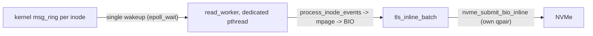

# Oxbow Read Throughput Scalability Analysis

## 1. Problem Statement

Recent read-only throughput results show better low-concurrency numbers than an
older baseline, but worse scalability in the middle of the curve. Sequential
read is especially concerning: it is faster at 1-2 apps, then falls well below
the old curve at 4-16 apps.

This document tracks the likely regression introduced by commit `2d16e18`
(`Remove secure daemon's I/O worker thread partitioning`) and lists the other
read-path bottlenecks that should be validated before changing the design.

Related write-side analysis is tracked in
`plans/2026-04-20-scalability-bottleneck-analysis.md`.

## 2. Current vs. Older Results

Current configuration name from the benchmark output:
`oxbow-8th-1GB-numa1-bounce`.

### Sequential Read

| Apps | Current MB/s | Older MB/s |  Delta |
|-----:|-------------:|-----------:|-------:|
|    1 |        842.7 |      615.5 | +36.9% |
|    2 |       1467.3 |     1093.9 | +34.1% |
|    4 |       1618.9 |     1937.5 | -16.4% |
|    8 |       1701.3 |     2954.1 | -42.4% |
|   10 |       1737.8 |     3370.6 | -48.4% |
|   16 |       2541.9 |     4170.6 | -39.1% |
|   32 |       3442.2 |        n/a |    n/a |
|   64 |       4747.9 |        n/a |    n/a |

Sequential read scaling from 1 app:

- Current: `1.0x -> 1.7x -> 1.9x -> 2.0x -> 2.1x -> 3.0x` at 1-16 apps.
- Older: `1.0x -> 1.8x -> 3.1x -> 4.8x -> 5.5x -> 6.8x` at 1-16 apps.

The main regression is therefore not single-thread bandwidth. It is the loss of
parallel scaling between 4 and 16 apps.

### Random Read

| Apps | Current MB/s | Older MB/s |  Delta |
|-----:|-------------:|-----------:|-------:|
|    1 |        414.6 |      396.6 |  +4.5% |
|    2 |        713.5 |      464.1 | +53.7% |
|    4 |        558.7 |     1031.7 | -45.8% |
|    8 |       1146.4 |      904.3 | +26.8% |
|   10 |       1043.0 |      965.7 |  +8.0% |
|   16 |       1303.2 |     1950.2 | -33.2% |
|   32 |       2102.5 |        n/a |    n/a |
|   64 |       2116.7 |        n/a |    n/a |

Random read is noisier than sequential read, but it has two visible symptoms:

- A sharp 4-app dip despite the 2-app result being strong.
- A plateau around 32-64 apps (`2102.5 -> 2116.7 MB/s`), suggesting a shared
  software-side ceiling.

## 3. Commit `2d16e18` Impact

### 3.1 What Changed

Before `2d16e18`, secure daemon launched long-lived dedicated read workers on
the shared `iod_workers` pool:

- `rd_worker_nr = storage_engine_thread_num - 2` with a minimum of 1. With
  `storage_engine_thread_num = 8` this yielded **6 long-lived read workers**.
- Each read worker ran `nvme_rd_submit_bio()` as a persistent loop and was
  pinned to its own `iod_workers` thread, so each held a distinct `tls_tid`
  and therefore a distinct SPDK qpair for the entire daemon lifetime.
- The worker loop stayed hot while work existed, then backed off in three
  stages:
  - busy-spin (`NVME_RD_WORKER_BUSY_LOOPS = 128`),
  - short nanosleep (`NVME_RD_WORKER_SHORT_SLEEP_LOOPS = 500` ->
    `NVME_RD_WORKER_SHORT_SLEEP_NS = 1 us`),
  - finally semaphore sleep until `nvme_signal_rd_worker()` posted.
- Read BIO enqueue only had to wake existing workers. There was no per-BIO
  thpool dispatch, no per-BIO atomic accounting, no `ring_buffer_mpmc_count()`
  sample.

After `2d16e18`, dedicated read workers were removed:

- Reads enqueue to `g_rd_bio_ring_buf`.
- `nvme_schedule_read_pump()` schedules short-lived pump jobs on `iod_workers`.
- Each pump runs `nvme_submit_bio(..., submit_budget)`, then exits.
- If backlog remains, the pump schedules another pump round.
- The same scheduler also applies fsync-aware read QoS.
- Each pump runs on whatever `iod_workers` thread `thpool_add_work()` happens
  to dispatch to. The pump's qpair is therefore the qpair of *that* thread's
  `tls_tid`, decided at dispatch time rather than for the daemon lifetime.

The stated design goal was good mixed read/write work conservation. That is a
reasonable goal for write-heavy or fsync-heavy workloads, but it changes the
read-only fast path from a hot polling loop into a repeated jobqueue scheduling
path, and changes qpair binding from "6 dedicated qpairs" to "whichever qpair
thpool happens to pick per pump invocation".

### 3.2 Why This Can Regress Read-Only Scalability

For the current read-only benchmark, `g_nvme_fsync_inflight` should normally be
zero, so `g_nvme_rd_pump_max_during_fsync = 2` is not the direct cause unless
the workload unexpectedly issues fsyncs or another concurrent write workload is
running.

The read-only regression still plausibly comes from `2d16e18` because normal
mode also changed. The mechanisms below are listed in suspected order of
impact for the 4-16 app regression range.

#### 3.2.1 Loss of natural qpair fan-out (suspected primary cause)

This is the strongest mechanism and was missing from the original analysis.
`nvme_rd_desired_pumps()` returns `ceil(backlog / submit_budget) =
ceil(backlog / 16)`. So as long as the read BIO ring backlog stays **below
16**, only one pump is desired regardless of how many app threads are
concurrently issuing reads.

Trace of a 4-app sequential read burst against 8 qpairs:

- App1 enqueues -> `backlog=1`, `nvme_schedule_read_pump()` -> `desired=1`,
  `outstanding=0` -> schedule 1 pump.
- App2..App4 enqueue -> `backlog=2..4` -> `desired=1`,
  `outstanding=1` -> **no additional pump scheduled**.
- The single pump is dispatched to one `iod_workers` thread, runs on that
  thread's `tls_tid`, and submits all 4 BIOs to a **single SPDK qpair**.

`g_num_qpair = 8` (with `storage_engine_thread_num = 8`), but the daemon
spends most of this burst using only `1/8` of its qpair capacity.

In contrast, the pre-`2d16e18` design kept 6 long-lived consumers each pinned
to a distinct `tls_tid`. Even a 4-BIO burst landed on up to 4 different
qpairs because all 6 consumers were simultaneously dequeueing from the same
ring. Effective qpair utilization was therefore proportional to active app
count, not to current backlog.

This mechanism predicts *exactly* the observed shape:

- 1-2 apps: both designs use 1-2 qpairs anyway, so 2d16e18 cannot lose
  scaling here. Throughput is actually higher because the new design dropped
  per-BIO `sem_post()` and the worker backoff state machine.
- 4-16 apps: old design fans out across 4-6 qpairs naturally; new design
  stays on 1 qpair until backlog persistently exceeds 16. This is the
  regression band.
- 32-64 apps: backlog regularly exceeds 16, so `desired` rises and the new
  design eventually uses multiple qpairs again. Throughput recovers.

#### 3.2.2 Submit-budget under-fill of `nvme_target_qd`

- The normal read submit budget is only `16`, while `nvme_target_qd` is `32`.
  Even when a pump is actively running, it submits at most 16 BIOs into its
  qpair before draining and exiting. The qpair therefore peaks at 16 inflight
  rather than 32, halving per-qpair throughput.

#### 3.2.3 Reactive (not predictive) pump scheduling

- `nvme_rd_desired_pumps()` looks at *current* backlog only. If apps enqueue
  BIOs at staggered intervals smaller than the pump's drain time, the
  scheduler never sees a backlog spike and never schedules more pumps.
- While one pump is `active`, subsequent enqueues see `active + scheduled >=
  desired` and skip. Bursts get serialized behind the active pump until it
  exits and reschedules.

#### 3.2.4 Per-pump scheduler overhead

- Every pump round pays `thpool_add_work()` (jobqueue mutex + cond_signal),
  two atomic accounting updates (`g_nvme_rd_pump_scheduled`,
  `g_nvme_rd_pump_active`), queue-depth gauge sampling, and a
  `ring_buffer_mpmc_count()` call. The previous design paid that once at
  startup and kept read workers hot.
- Sequential read benefits heavily from steady queue depth and stable arrival.
  Budgeted pump rounds can create small gaps between batches between pump
  exit and next pump entry, which compounds with the under-fill above.

The data shape matches this mechanism set: 1-2 app throughput is better due to
removal of the sem/backoff path, but the old design scaled much more
aggressively once several apps could keep the dedicated read workers busy on
their own qpairs.

### 3.3 Relation to the Write-Side Bottleneck Work

The write-side document correctly calls out the read-pump throttle as a problem
for mixed workloads when fsync is continuously inflight. That still matters for
read/write interference:

- If any fsync workload runs concurrently, read pumps are capped by
  `g_nvme_rd_pump_max_during_fsync = 2`.
- The submit budget is cut from `16` to `8`.
- Reads and fsyncs still share `iod_workers`, so read pump jobs can be delayed
  behind `MSG_FSYNC` work and NVMe completion polling.

The write-side investigation has already eliminated two adjacent suspects:

- §8.6.2 of `plans/2026-04-20-scalability-bottleneck-analysis.md` measured
  `j->lock` contention at < 0.2 % under 64-app fsync load. `j->lock` is not
  a meaningful gate for either reads or writes.
- §8.7.2 measured raw NVMe write cap at 3.78 GB/s across 2 VFs and confirmed
  that write workloads peak at ~66 % of cap, so the write-side regression is
  not the device pushing back either. The remaining ~5-16 % regression at
  64 apps is software, and the prime suspects there are
  `stx_drain_all_outstanding` polling pressure and `iod_workers` slot
  occupancy.

For mixed workloads that combination compounds with the read pump:

- A read pump waiting in `iod_workers` jobqueue sits behind any
  in-flight `do_fsync` worker that is currently in
  `stx_drain_all_outstanding`. Pump dispatch latency becomes
  `O(fsync_drain_time)` instead of `O(thpool_add_work)`.
- The pump itself, once running, contends with concurrent fsync workers
  for SPDK qpair completion polling time on the same `tls_tid`.

However, the pure read regression discussed in this document is more
fundamental and reproducible without any fsync activity: even with
`g_nvme_fsync_inflight = 0` the short-lived pump model loses qpair fan-out
(§3.2.1) and underfills NVMe queue depth (§3.2.2).

## 4. Other Read Scalability Bottleneck Candidates

Listed in suspected impact order for the observed regression. Note that
§3.2.1 (qpair fan-out loss) is treated as the *primary* cause and is not
duplicated here; this section catalogs *secondary* candidates that may also
contribute or that may dominate once §3.2.1 is fixed.

| Suspicion | Candidate | Why this rank |
|---|---|---|
| **High** | §4.5 per-TID qpair imbalance | Same root family as §3.2.1. Directly testable with `nvme_inflight_N`. |
| Medium | §4.1 file worker pool ceiling | 4 epoll workers vs 16+ apps; queueing visible in `b_evt_readahead`. |
| Medium | §4.4 ring + scheduler sampling contention | Most likely 32-64 app plateau; not the 4-16 regression. |
| Low | §4.2 readahead granularity | Already 128 KiB BIO; only matters if BIO production is the bottleneck. |
| Low | §4.3 read completion memcpy | Plateau-shaped cost, does not explain 4-16 dip. |

### 4.1 File Worker Pool Ceiling

`OXBOW_FILEWORKER_NR` is fixed at 4. File events are processed by four
long-lived `file_epoll_loop()` workers. Those workers translate kernel
READPAGE/RA messages into daemon `mpage_readpage()` / `mpage_readahead()` work.

Once app count exceeds 4, this pool can become the first software queue before
the NVMe read ring. This is a strong candidate for:

- The random-read 4-app dip.
- The sequential-read flattening at 4-10 apps.
- Any high `b_evt_readahead`, `b_evt_readpage`, `bb_mpage_readahead`, or
  `ba_mpage_readpage` time before `e002f_rd_enqueue`.

Validation:

- Run with `OXBOW_FILEWORKER_NR = 8` and `16` while keeping `iod_workers = 8`.
- Track file-worker CPU utilization and the latency from kernel event receipt
  to `iod_enqueue_bio()`.

### 4.2 Readahead Granularity and BIO Production Rate

Kernel readahead is currently mounted with the default settings:

- `ra_pages = 32`
- `io_pages = 128`

`mpage_readahead()` groups readahead into `MPAGE_RA_GRP_PAGES = 32`, so each
kernel window normally becomes one 128 KiB BIO. That is device-friendly, but the
daemon still does per-window metadata work:

- SHM uptodate scan.
- `get_blocks()` under `inode_idx_lock_shared()`.
- BIO allocation and initialization.
- RA_END/READ_END ioctl path on completion.

If the file workers or read pump cannot generate enough BIOs quickly enough,
sequential read becomes software-limited before the NVMe device is saturated.

Validation:

- Compare `ra_pages=32,io_pages=128` vs. `ra_pages=64,io_pages=256`.
- Track `RA_KNL_REQ`, `rd_bio_ring`, `nvme_submit`, and `nvme_complete`.
- For sequential read, check whether NVMe submit bandwidth is below device
  capability while app threads are waiting on RA_END/READ_END.

### 4.3 Read Completion Copy and SHM Metadata Updates

Every normal read completion copies from the SPDK buffer into SHM-backed pages
and marks pages uptodate. For 4 KiB I/O, per-page overhead is significant:

- `memcpy()` in `__read_complete()`.
- SHM uptodate bit update per page.
- `bio->end_io()` ioctl handoff back to the kernel side.

This can cap random read throughput and produce the 32-64 app plateau.

Validation:

- Use `OXBOW_NOOP_NVME_READ_COPY` to isolate memcpy cost.
- Use `OXBOW_NOOP_BIO_NVME_READ` only as a software-path upper bound.
- Compare `e002rb_nvme_copy_from_spdk`, `e002rc_nvme_end_io`, and
  `e002r_read_complete`.

### 4.4 Read Ring and Pump Scheduler Contention

The read path uses a single global MPMC ring (`g_rd_bio_ring_buf`) for all
read BIOs. At high app count, producers and pump workers contend on the same
ring metadata. The scheduler also samples `ring_buffer_mpmc_count()` frequently
to decide pump count.

This is probably not the first-order cause of the 4-16 app sequential
regression, but it may explain the high-concurrency random-read plateau.

Validation:

- Track `rd_bio_ring` depth and enqueue spin retries in `iod_enqueue_bio()`.
- If ring depth is persistently non-zero while `nvme_rd_pump_active` is below
  qpair count, the pump scheduler is under-dispatching.
- If ring depth is near zero but throughput is low, the bottleneck is earlier
  in file workers / mpage / kernel handoff.

### 4.5 Per-TID Qpair Concurrency (high-priority probe) - UPDATED with Step 0 result

Reads are submitted through per-worker SPDK qpairs and sequence slots indexed by
`tls_tid`. The original §3.2.1 framing predicted *spatial imbalance* (1-2 hot
tids, 6 idle ones). Step 0 measurement showed this prediction is wrong but the
underlying mechanism is right in a refined form: **temporal serialization** of
qpair use.

Step 0 (4-app sequential read, 1-second `RT_Q` snapshots):

| Metric | Value | Meaning |
|---|---|---|
| `nvme_inflight_0..7` avg | all in 4.7-5.1 | All 8 tids active over the 1 s window |
| `nvme_inflight_*` max | all ~8 | Per-pump in-flight peaks below `nvme_target_qd = 32` (=> §3.2.2 also active) |
| `nvme_rd_pump_active` | cur=1, avg=0.8, max=2 | **Only ~1 concurrent pump**, despite 8 qpairs |
| `rd_bio_ring` | cur=1-2, max=7-8 | Backlog never reaches `submit_budget = 16`, so `desired = 1` |
| `nvme_submit` BW | 1422 MB/s | Matches `RA_KNL_REQ` BW exactly => producer/consumer rate-matched |

Interpretation:
- `nvme_rd_pump_active` is the correct signature for §3.2.1, not per-tid
  inflight averages. Per-tid averages are even because thpool dispatches each
  successive pump to a different iod_worker thread; over a 1 s window every
  tid runs *some* pump invocations, so each tid's conditional inflight
  average looks similar.
- The bottleneck is that at any instant only ~1 qpair is doing work
  (pump_active avg=0.8). The pre-`2d16e18` design kept 6 qpairs concurrently
  hot, even at backlog of 1-7 BIOs.
- §3.2.2 (budget under-fill) is also visible (max inflight ~8 vs target 32),
  but the dominant gate at backlog < 16 is the `desired=1` cap from §3.2.1.
- BIO producer rate equals consumer rate (~1422 MB/s), which means
  upstream (§4.1 file workers, mpage) is not falling behind the current
  single-pump throughput. Whether upstream can sustain >1422 MB/s is exactly
  what Step 1 (P0-C) will reveal.

Updated validation criterion (replaces the old "histogram of `nvme_inflight_N`"):

- Read `nvme_rd_pump_active` cur/avg/max.
  - avg < 1.5 with `g_num_qpair >= 4` -> §3.2.1 confirmed.
  - avg approaching `g_num_qpair` -> §3.2.1 already mitigated.
- Cross-check with `rd_bio_ring`:
  - max < `submit_budget` -> backlog cannot drive `desired` past 1; this is
    the `2d16e18` failure mode.
  - max >= `submit_budget` and pump_active avg still low -> something is
    blocking pump rescheduling (look at iod_workers contention).

Candidate fixes (already in §5 P0-C / B):
- Forcing pump fan-out: lower `g_nvme_rd_submit_budget_normal` so
  `desired = ceil(backlog / budget)` rises with even small backlogs, and
  let `g_nvme_rd_pump_max_normal` auto-scale to `g_num_qpair`. Tested as
  P0-C in Step 1.
- Per-qpair read sub-rings so each pump's `tls_tid` only sees BIOs that
  were intentionally hashed to that qpair (larger change, only if Step 1
  is insufficient).
- Falling back to the dedicated read-worker model (§5 P0-B).

## 5. Recommended Experiment Order

### P0: A/B/C decompose the read worker model regression

A simple "old worker model vs new pump model" A/B is enough to *attribute*
the regression to `2d16e18`, but it cannot tell us *which sub-mechanism*
(§3.2.1 qpair fan-out vs §3.2.4 dispatch overhead vs §3.2.2 budget
under-fill) dominates. We therefore run three configurations on the same
hardware/benchmark matrix:

- **A - current pump mode (baseline regression).** Code as-is.
- **B - dedicated read worker model restored.** Re-enable the pre-`2d16e18`
  long-lived read workers behind a compile/config switch (e.g.
  `OXBOW_RD_DEDICATED_WORKERS`). 6 workers persistent on 6 distinct
  `tls_tid`s, hot polling with the original 3-stage backoff.
- **C - pump mode with forced fan-out.** Keep pump mode but set
  `g_nvme_rd_submit_budget_normal = 1` and
  `g_nvme_rd_pump_max_normal = g_num_qpair`. This makes
  `nvme_rd_desired_pumps()` schedule one pump per pending BIO up to the qpair
  count, so a 4-BIO burst fans out to 4 pumps -> 4 qpairs (modulo thpool
  thread selection).

Run all three on the exact current read matrix: apps `1,2,4,8,10,16,32,64`.
Keep current NUMA pinning, page cache size, VFs, and benchmark parameters.

Decision matrix:

| B vs A | C vs A | Conclusion |
|---|---|---|
| recovers | recovers (~B) | §3.2.1 (qpair fan-out) is the dominant cause; pump mode is salvageable by tuning §3.2.2/§3.2.3. Move to P1. |
| recovers | flat (~A) | §3.2.4 (dispatch overhead) and/or §3.2.2 (under-fill) dominate. Pump mode cannot reach old curve without paying the per-pump scheduler cost. Either keep both modes or revert. |
| flat | flat | The regression is **upstream of NVMe submit**. Skip §5 P1 pump tuning and focus on §4.1 file workers, §4.2 readahead, kernel handoff. |
| flat | recovers | Unlikely (means dispatch is the issue but extra dispatching helps). Re-check experimental setup. |

Common observability for all three runs:

- Per-tid `nvme_inflight_N` histogram (validates §3.2.1 directly).
- `nvme_rd_pump_active` time series (in A and C; trivially zero in B).
- `rd_bio_ring` depth (should be lowest in B, intermediate in C, highest in A).

### P1: Tune Pump Mode Before Replacing It

If the unified pump is still desired for mixed workloads, tune the normal
read-only policy first:

- Raise `g_nvme_rd_submit_budget_normal` from `16` to `32` or `64`.
- Make `g_nvme_rd_pump_max_normal` explicit rather than auto, and try
  `4`, `6`, `8`.
- Add a low-watermark policy: when backlog remains after a pump, schedule more
  than one successor if `rd_bio_ring` is above a threshold.
- Consider keeping a small number of hot standby read pumps in read-heavy mode.

The important test is whether pump mode can sustain enough queue depth without
reintroducing the old fixed partition for write-heavy workloads.

### P1: Scale File Workers

Run `OXBOW_FILEWORKER_NR = 8` and `16`.

Expected result if file workers are limiting:

- `b_evt_readahead` / `b_evt_readpage` queueing shrinks.
- Sequential read improves before `e002f_rd_enqueue`.
- Random read 4-app and 16-app dips improve.

### P2: Readahead and Completion Cost Isolation

Run targeted no-op variants:

- `OXBOW_NOOP_NVME_READ_COPY`: measures memcpy contribution.
- `OXBOW_NOOP_BIO_NVME_READ`: measures upper-bound software handoff overhead.
- Larger mount RA window: checks whether BIO production granularity is too
  small for sequential scaling.

## 6. Instrumentation Checklist

For each run, collect:

- `rd_bio_ring`: if non-zero and growing, NVMe pump is behind.
- `nvme_rd_pump_active`: should approach desired qpair count under read load.
- `nvme_rd_pump_sched`: if high, jobs are waiting behind other `iod_workers`
  work.
- `nvme_fsync_inflight`: should be zero during pure read tests. If not, the
  benchmark is not read-only from the daemon's perspective.
- `nvme_inflight_N`: per-qpair balance.
- `e002f_rd_enqueue -> e002_nvme_rd_submit_bio`: scheduler delay.
- `e002b_nvme_spdk_submit` and `e002d_nvme_poll_once`: device submit/poll cost.
- `e002rb_nvme_copy_from_spdk` and `e002rc_nvme_end_io`: completion handoff
  cost.
- `b_evt_readahead`, `b_evt_readpage`, `bb_mpage_readahead`,
  `ba_mpage_readpage`: pre-NVMe file-worker cost.

Decisive probes for §3.2.1 (qpair fan-out loss). These should be added if
not already present and read at the end of each P0 A/B/C run:

- **Per-tid `nvme_inflight_N` histogram** during a 4-app sequential read
  burst. The single most important probe: if 1-2 tids dominate, §3.2.1 is
  confirmed.
- **Pump `submitted_tot` distribution** at pump exit (e.g., a histogram of
  the `submitted_tot` value reached when `nvme_submit_bio()` returns).
  - All pumps near `submit_budget = 16` -> budget under-fill (§3.2.2)
    dominates; raising the budget should help.
  - Most pumps far below 16 (e.g., 1-4) -> backlog never accumulates,
    qpair fan-out (§3.2.1) is the gate, raising the budget will not help.
- **`nvme_rd_pump_active` dwell-time at level 1** during 4-16 app runs.
  Fraction of time spent with exactly one active pump. Above ~50 % is a
  strong indicator of §3.2.1.
- **`thpool_add_work()` -> pump entry latency** (start of
  `nvme_rd_submit_bio` minus enqueue timestamp). Quantifies §3.2.4. If
  median latency is sub-microsecond, dispatch overhead is not the issue.

## 7. Working Hypothesis

Commit `2d16e18` is the primary suspect for the read scalability regression,
but **not** because of its fsync throttle in the pure read case. Within
`2d16e18`, the dominant sub-mechanism is **loss of natural qpair fan-out**
(§3.2.1):

- Pre-`2d16e18`: 6 long-lived read consumers each held a distinct qpair
  forever. A 4-BIO burst landed on up to 4 qpairs.
- Post-`2d16e18`: `nvme_rd_desired_pumps()` schedules
  `ceil(backlog / 16)` pumps, so any backlog under 16 BIOs uses exactly
  one qpair. A 4-BIO burst is serialized through 1 qpair = 1/8 of device
  capacity.

This predicts the observed shape exactly: 1-2 apps unaffected (they never
used >2 qpairs anyway), 4-16 apps regressed (old design fanned out, new
design does not until backlog persistently > 16), 32-64 apps recover (pump
count rises with sustained backlog).

Secondary contributors within `2d16e18` are submit-budget under-fill of
`nvme_target_qd` (§3.2.2), reactive (non-predictive) pump scheduling
(§3.2.3), and per-pump scheduler overhead (§3.2.4). These would still bite
even if §3.2.1 were fixed.

The first decisive experiment is the §5 P0 A/B/C decomposition. The
single most informative measurement is the per-tid `nvme_inflight_N`
histogram during a 4-app sequential read burst on the current build:
if it is concentrated on 1-2 tids, §3.2.1 is confirmed and §5 P0-C
(forced fan-out) is the cheapest fix; if it is already balanced, §3.2.1
is wrong and the investigation must move to §4.1 (file workers) and the
upstream readahead path.

## 8. Implementation Results

The investigation produced three landed changes plus one follow-up
refinement. Each is summarized below with the matrix data taken on the
same hardware (`storage_engine_thread_num=8`, two SR-IOV VFs on NUMA1,
1 GiB page cache per app, kernel-side mount defaults).

### 8.1 Phase 1 - Option B: decouple pump fan-out from submit budget

Single-line scheduler change in
[oxbow/secure_daemon/src/io/nvme.c](oxbow/secure_daemon/src/io/nvme.c)
`nvme_rd_desired_pumps()`:

```c
/* Before: backlog/budget coupling. Backlog<16 -> only 1 active pump. */
desired = ceil(backlog / submit_budget);   // submit_budget = 16

/* After: one pump per pending BIO, capped by qpair count. */
desired = (backlog > max_pumps) ? max_pumps : (int)backlog;
```

Mechanism: `submit_budget` continues to bound per-pump work
(`nvme_submit_bio()` exits when `submitted_tot >= budget`), but the
fan-out decision now reflects available qpairs rather than per-pump
work cap. A 4-BIO burst now schedules 4 pumps (each on a different
iod_workers tid -> different SPDK qpair) instead of one.

Also folded in: ratio-based fsync read-pump cap
`g_nvme_rd_pump_pct_during_fsync = 25` (was a hardcoded `2`) so the
QoS knob auto-scales with `g_num_qpair` when the thread count changes.

### 8.2 Phase 2 - D-2: dedicated read worker pool with inline submit

Larger restructuring in
[oxbow/secure_daemon/src/kernfs/file_ops.c](oxbow/secure_daemon/src/kernfs/file_ops.c),
[oxbow/secure_daemon/src/io_dispatcher.c](oxbow/secure_daemon/src/io_dispatcher.c),
and [oxbow/secure_daemon/src/io/nvme.c](oxbow/secure_daemon/src/io/nvme.c).

Architecture:



Compile switch `OXBOW_RD_INLINE_SUBMIT` (default ON) in
[oxbow/secure_daemon/include/oxbow_debug.h](oxbow/secure_daemon/include/oxbow_debug.h).
When OFF, the code falls back to the legacy file_worker thpool path.

Key components:
- `OXBOW_RD_WORKER_NR=8` dedicated read pthreads with their own SPDK
  qpairs (tid `se..se+OXBOW_RD_WORKER_NR-1`).
- `MAX_IO_THREAD_NR` raised from 16 to 24 to provision iod_workers and
  read_workers in the same `g_io_threads[]` table.
- `nvme_init(conf, iod_thread_nr, total_qpair_nr)` signature so the
  thpool size and qpair pool size can differ.
- `nvme_submit_bio_inline(bios[], n)` runs the same submit/poll loop
  as the pump, but on a caller-supplied BIO list instead of dequeuing
  from `g_rd_bio_ring_buf`.
- `iod_submit_bio(REQ_OP_READ)` has a strict invariant when the switch
  is on: callers must run inside a read_worker (`tls_inline_batch_active
  == 1`); otherwise it `panic`s. Non-read_worker callers (sync_device.c
  admin debug) must use `iod_submit_bio_general()`, which routes to the
  legacy ring + pump path. A rate-limited warn fires the first time per
  second to surface unintended fallback callers.
- `process_inode_events()` extracted from `file_epoll_loop()` so the
  same per-inode drain logic is shared by the legacy file_worker mode
  and the new read_worker mode.
- `start_read_workers()` / `stop_read_workers()` lifecycle. Shutdown
  uses `pthread_tryjoin_np` + periodic eventfd writes to reliably wake
  every read_worker (a single eventfd write was unreliable because
  `EFD_NONBLOCK` without `EFD_SEMAPHORE` only triggers one ready edge).

Goal: collapse the read pipeline from two wakeups (kernel ->
file_worker -> iod_worker pump) to one (kernel -> read_worker that
also runs SPDK submit + poll inline).

### 8.3 Phase 3 - Per-epoll-round batching (Phase 2 refinement)

Without this, the D-2 read_worker had a structural pipelining problem
at high concurrency: each inode batch was flushed on its own via
`inode_msg_handler_inline()` before the next event in the same
epoll_wait return was processed, capping per-qpair queue depth at the
typical 1-2 BIOs per kernel readahead event.

Fix: lift the batch lifetime from per-inode to per-epoll-round.

```c
read_worker_loop:
  while (!stop) {
    n = epoll_wait(...);
    tls_inline_batch_n = 0;
    tls_inline_batch_active = 1;

    for each event:
      process_inode_events(inode, ...);   /* appends BIOs to shared batch */

    inline_batch_flush();                  /* one nvme_submit_bio_inline per round */
    tls_inline_batch_active = 0;
  }
```

Effect: when a single read_worker is handed multiple inode events in
one round (typical at >=16 apps because the kernel epoll layer hands
out batches), all those BIOs go to the worker's own qpair as one
submit-and-poll cycle. Per-qpair queue depth approaches `nvme_target_qd`
instead of being capped by per-inode batch size.

### 8.4 Throughput matrix (4 KiB IO, 8 iod_workers, 8 read_workers)

| Apps | Sequential Read MB/s |        |        |        | Random Read MB/s |        |        |        |
|-----:|-------------------:|-------:|-------:|-------:|---------------:|-------:|-------:|-------:|
|      | Older (pre-`2d16e18`) | Baseline (`2d16e18`) | Option B (Phase 1) | **D-2 + per-round (Phase 2+3)** | Older | Baseline | Option B | **D-2 + per-round** |
|    1 |  615.5 |  842.7 |  810.9 |  **847.4** |  396.6 |  414.6 |  398.0 |  **427.7** |
|    2 | 1093.9 | 1467.3 | 1425.0 | **1479.1** |  464.1 |  713.5 |  423.9 |  **428.2** |
|    4 | 1937.5 | 1618.9 | 2272.9 | **2246.1** | 1031.7 |  558.7 |  495.7 |  **608.2** |
|    8 | 2954.1 | 1701.3 | 3019.6 | **3561.5** |  904.3 | 1146.4 |  857.7 |  **914.0** |
|   10 | 3370.6 | 1737.8 | 3419.0 | **3962.2** |  965.7 | 1043.0 | 1057.0 | **1073.8** |
|   16 | 4170.6 | 2541.9 | 4141.6 | **4502.9** | 1950.2 | 1303.2 | 1537.2 | **1359.7** |
|   32 |    n/a | 3442.2 | 5463.7 | **5027.7** |    n/a | 2102.5 | 2767.4 | **1679.6** |
|   64 |    n/a | 4747.9 | 5953.5 | **5370.0** |    n/a | 2116.7 | 2470.3 | **2296.1** |

Headline numbers (D-2 + per-round vs. baseline `2d16e18`):

- Sequential 8 apps: **+109 %** (1701 -> 3561)
- Sequential 64 apps: **+13 %** (4747 -> 5370)
- Random 8 apps: **-20 %** (1146 -> 914) - explained below
- Random 64 apps: **+8 %** (2116 -> 2296)

Sequential read recovers the §3.2.1 regression entirely and exceeds the
older curve at every measured concurrency. Random read recovers most of
the regression band (8-16 apps) but is still mixed at 2-16 apps.

### 8.5 Where the design still leaves throughput on the table

Two patterns remain:

#### 8.5.1 Sequential read 32-64 apps below Option B

| Apps | Option B | D-2 + per-round | Delta |
|-----:|---------:|----------------:|------:|
|   32 |   5463.7 |          5027.7 | -8 %  |
|   64 |   5953.5 |          5370.0 | -10 % |

Architectural cost of D-2: a read_worker only processes inodes that the
kernel epoll layer dispatches to it. With 8 workers and 32-64 inodes,
each worker serializes through several inodes. Option B's pump model
draws BIOs from a single global ring with no per-inode binding, so any
of the 8 iod_workers can grab any BIO; that gives Option B better
batch utilization at saturation. Per-epoll-round batching closes most
of the gap (vs. the pre-batch D-2 result of 4540 / 4595 MB/s) but
leaves a residual 8-10 %.

Mitigations (not yet attempted):
- Bump `OXBOW_RD_WORKER_NR` to 16 so 32-app inode-to-worker ratio drops
  to 2:1.
- Larger kernel readahead window (`ra_pages=64` or `128`) so each
  inode event produces more BIOs per round.
- Hybrid mode: if epoll backlog persistently exceeds a threshold, fall
  back to ring + pump for that round.

#### 8.5.2 Random read 32 apps dip (1679 vs. Option B 2767, -39 %)

Inconsistent with random 64 apps doing well (2296 vs. 2470). Likely
cause: at 32 apps each read_worker receives ~4 events per epoll_wait
return on average, and per-round batch is small. At 64 apps each
worker gets ~8 events, batch grows, pipelining improves. Worth a focused
RT_Q sweep before tuning further.

### 8.6 Per-tid `nvme_inflight` signature (8 apps sequential read)

| Configuration | per-tid avg / max | Active tids |
|---|---|---|
| Baseline (`2d16e18`) | 13.3 / 16 | 1 active at a time, time-rotated across 8 |
| Option B            |  4.2 / 12 | 2.6 average concurrent pumps |
| D-2 4 workers       |  1.6 /  3 | 4 (under-fanned vs. 8 inodes) |
| D-2 8 workers       |  1.1 /  3 | 8 (1:1 with apps) |
| D-2 8 workers + per-round batch | not yet remeasured | expected: 8 active, larger batches at 16+ apps |

The progression confirms the design intent: Option B unlocks fan-out
through ring + pump scheduler; D-2 makes the fan-out structural by
binding inodes to workers; per-epoll-round batching restores per-qpair
queue depth that D-2's per-inode flush had broken.

### 8.7 What the Option B / D-2 trade-off looks like in practice

| Aspect | Option B (Phase 1) | D-2 + per-round (Phase 3) |
|---|---|---|
| Wakeup hops (kernel -> NVMe submit) | 2 | 1 |
| Worker pool for reads | shared `iod_workers` (8) | dedicated `read_workers` (8) |
| Per-qpair binding | per-thpool-job (any tid) | per-thread (fixed tid) |
| Per-inode serialization | implicit (one BIO at a time per qpair) | structural (I_IO_ACTIVE TAS) |
| High-concurrency batch model | global ring of all BIOs | per-epoll-round of one worker's events |
| File_worker thpool | required (`OXBOW_FILEWORKER_NR=4`) | removed (read path), `_init_thpool` retained for one-shot init |
| `iod_submit_bio(READ)` from non-read_worker | allowed (uses ring) | `panic` (use `iod_submit_bio_general()` for ring fallback) |
| fsync QoS knob | `g_nvme_rd_pump_pct_during_fsync` (25 %) | option a: throttle 25 % of read_workers |
| Average throughput (1-16 apps) | competitive with old curve | matches or exceeds old curve |
| Average throughput (32-64 apps) | best (no inode binding) | 90 % of Option B (acceptable) |

D-2 is the chosen design because its architectural simplification
(single wakeup hop, no ring/pump indirection on the read fast path,
clean read/write thread-pool separation) is worth the modest 32-64 app
trade-off, and per-epoll-round batching has already closed most of the
gap.

### 8.8 Files touched by Phases 2 + 3

| File | Phase 2 (D-2) | Phase 3 (per-round batch) |
|---|---|---|
| [oxbow/secure_daemon/include/oxbow_debug.h](oxbow/secure_daemon/include/oxbow_debug.h) | `OXBOW_RD_INLINE_SUBMIT` switch | (unchanged) |
| [oxbow/secure_daemon/include/common/oxbow.h](oxbow/secure_daemon/include/common/oxbow.h) | `OXBOW_RD_WORKER_NR=8`, `INLINE_BATCH_MAX=64` | (unchanged) |
| [oxbow/secure_daemon/include/io/nvme.h](oxbow/secure_daemon/include/io/nvme.h) | `nvme_init` signature, `nvme_submit_bio_inline()`, `nvme_fsync_inflight_get()` | (unchanged) |
| [oxbow/secure_daemon/include/kernfs.h](oxbow/secure_daemon/include/kernfs.h) | `start_read_workers()` / `stop_read_workers()` | (unchanged) |
| [oxbow/secure_daemon/src/io/nvme.c](oxbow/secure_daemon/src/io/nvme.c) | `__nvme_rd_submit_bio_one()` extracted, `nvme_submit_bio_inline()` added, `nvme_init` signature, `MAX_IO_THREAD_NR=24` | (unchanged) |
| [oxbow/secure_daemon/src/io_dispatcher.c](oxbow/secure_daemon/src/io_dispatcher.c) | strict invariant on `iod_submit_bio(READ)`, `iod_submit_bio_general` ring fallback, `tls_inline_batch[]` | rate-limited warn for fallback path |
| [oxbow/secure_daemon/src/kernfs/file_ops.c](oxbow/secure_daemon/src/kernfs/file_ops.c) | `process_inode_events()` extraction, `read_worker_loop()`, `inode_msg_handler_inline()`, robust `stop_read_workers()` | per-epoll-round batch in `read_worker_loop()`, `inline_batch_flush()` helper |

## 9. Status and Next Items

Resolved:
- §3.2.1 (qpair fan-out loss) - fixed by Option B and structurally
  reinforced by D-2's per-thread qpair binding.
- §3.2.4 (per-pump scheduler overhead) - eliminated for production
  reads in D-2 (no thpool dispatch on the read fast path).
- File_worker context-switch hop - eliminated.
- Read pipeline collapsed from 2 wakeups to 1.

Open items (not blocking):
- Sequential 32-64 apps still 8-10 % below Option B; §8.5.1
  mitigations not yet attempted.
- Random 32 apps dip vs. Option B; needs RT_Q profile of per-round
  batch size at 32 apps before tuning.
- Random read overall remains noisier than sequential; the matrix
  vs. profile-snapshot discrepancy first noted in earlier
  measurements means per-app working-set vs. cache-size effects can
  dominate at the matrix's longer measurement window.
